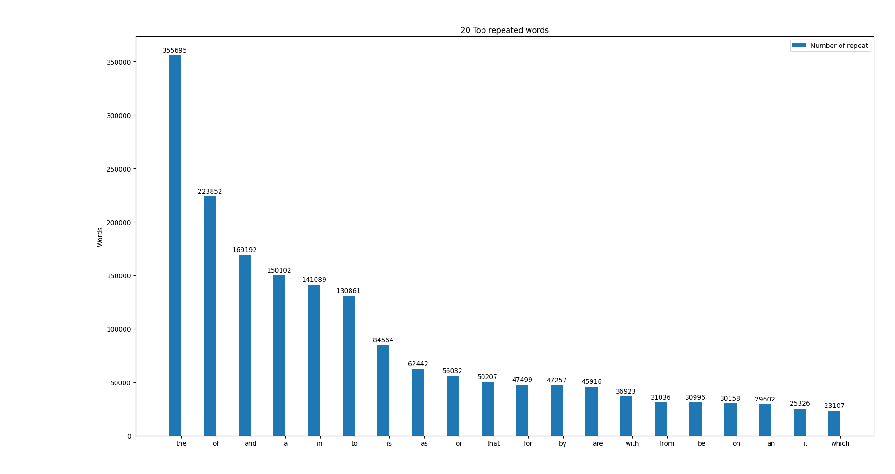
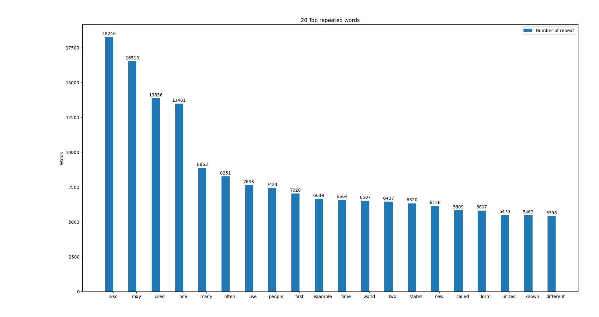

# Report

## Dataset resources

There are various wordlists across the internet. We choose a 3K word list and save it in `data/wordlist.txt`. 

### Wikipedia

We need lots of sentences to create our dataset. Wikipedia is a free encyclopedia in that we can get lots of content by giving a single word. We get the content of Wikipedia for every single word in our `wordlist.txt` and save these raw data in `data/wikipedia_raw/`.

### Kaggle spell wordlist

Aside from Wikipedia, We use the `data/kaggle_spell_list/` files and make it cleaner by generating a CSV file (`data/kaggle_spell_dataset.csv`).

You can download the dataset in this [link](https://www.kaggle.com/datasets/bittlingmayer/spelling).

## Process of collecting the dataset

We use the `crawler.py` script to aggregate these data.

The script aggregates and cleans up some data and saves them in the `data/` directory. You need to download your wordlist to execute this code. (default: `data/wordlist.txt`)

### Steps

1. Download the wordlist.

2. Read the wordlist.

3. Download the Wikipedia content for every single word in the wordlist.

4. Save all of these contents in separate files in `data/wikipedia_raw/`.

5. Read the Kaggle spell list.

6. Parse and clean the Kaggle spell list.

7. Save the Kaggle spell list in a CSV file `data/kaggle_spell_dataset.csv`.

### Tools

- Wikipedia SDK: This crawler uses the Wikipedia SDK tool to fetch the content of Wikipedia.

- Alive progress: It is just a progress bar for showing the status.

```python
import wikipediaapi
from alive_progress import alive_bar

if __name__ == '__main__':
    print('Downloading Wikipedia data...')
    # Use Wikipedia API to fetch the summary of the word
    with alive_bar(len(word_list), bar='bubbles', spinner='notes2') as bar:
        for word in word_list:
            try:
                page_py = wiki_wiki.page(word)
                raw_wikipedia_data[word] = page_py.text
            except Exception as err:
                print(f'Can not fetch word:\"{word}\", err: {err}')
            bar()
```

### How to run crawler

```bash
python3 src/crawler.py
# Reading word list...
# Downloading Wikipedia data...
# <●●●●●●●●●●●●●●●●●●●                     > ♫♬  ♪♫♬ ♩♪♫♬ 1428/2999 [48%] in 6:29 (3.7/s, eta: 7:08) 
```

After running this, the generated files under `data/` directory look like this.

```bash
tree .
# The output
# ├── README.md
# ├── data
# │   ├── kaggle_spell_dataset.csv
# │   ├── wikipedia_raw
# │   │   ├── AIDS.txt
# │   │   ├── AM.txt
# │   │   ├── African-American.txt
# │   │   ├── African.txt
# │   │   ├── American.txt
# │   │   ├── ...
# │   │   ├── ...
```

It should be about 45MB with the default wordlist.

## Project Structure

- `src/` - for the scripts

- `data/` - a directory for all kinds of data
  
  - `data/wikipedia_raw/` - the downloaded pages of Wikipedia
  
  - `data/kaggle_spell_list/` - Kaggle spell correction data set. [link](https://www.kaggle.com/datasets/bittlingmayer/spelling).
  
  - `data/wordlist.txt` - It is the main wordlist. You can change this file.

- `run.sh` - a file for generating the data set files. (crawling, preprocessing,...)

### Datasets

- Wikipedia dataset: It is a CSV file; the first column is a sentence with some spell correction errors. The second column is the sentence with the correct format.

- Kaggle spell dataset: It is a CSV file; the first column is a correct word. The second column is the word with a dictation issue.

- sample dataset is saved on this [link](https://drive.google.com/drive/folders/1I4XX3PjHT88RxuCAlYhwA34n_z9djVQ9?usp=sharing) .

## Preprocessing

- `src/preprocessing.py` contains any preprocessing steps to convert raw data to cleaned data.

### Steps

1. Open all text files that stored in `data/wikipedia_raw`. read and concat their texts in a long string. This step has done in the main method.

2. Break the sentences of whole text. This step has been done by nltk.sent_tokenize method. result is saved on `data/sentences.csv`.

3. Then we pass each sentence to our tokenizer method which takes a sentence and returns it tokens. This method is implemented by nltk.tokenize.TreeBankWordTokenizer(). We have choosed this tokenizer because it separates punctuations too. So we will have tokens including numbers and punctuations and words. 

4. Now we can check each of tokens and filter the ones that only consists of english characters. we can handle this by a regex. Result of this step is saved on `data/english_words.csv`.
	- Since the task is spell correction, We need to correct stop words and short words too. so we haven't eliminated them. We don't need stemming too because we need the exact correct form of each word.

	- We have implemented some helpful methods for our preprocessing. list_to_string and save_csv are these ones.

## Labeling unit

We merged all of the contents of Wikipedia and considered every single sentence a unit. We manipulated the words by adding noise to these sentences.

### Adding noise to data

This is an important part of phase1 of our project. The goal is to make some typical misspelled words so we can fit the data to a model, since we have the correct words either. This is implemented in `src/noise_generation.py`.

1. As you can guess, First of all we should load the cleaned data from `english_tokens.csv` and store it in a big list.

2. We have devided each sentence to its words by only using .split(' '). Because this clean data only separates the tokens with ' ' character.

3. We iterate all sentences and pass it's tokens to noist_text() method. this method needs a maximum noise rate that now we set that to 0.3. this means that the maximum probability of a token for being noisy is 0.3.

4. In noisy_text() method we decide whether a token benefits noise or not. the possibility of that is dependent ofthe token size too, And for shorter words it is lower surely.

5. Then if the token is chosen to be noisy, We call change_token() for that. In this method a random index of the token is picked and we decide the noise algorithm by non-equal chance. this has some constand probabilities too. these are the algorithms:

	- replace_noise: this method replaces the indexed character with a random character around that on keyboard.

	- extra_noise: adds a random character to choosen index of the token.

	- eliminate_noise: removes indexed character.

	- transposition_noise: changes the position of the indexed character with the last character before that.

6. Save the new mistaken sentences as the first column and the correct sentences as the second column of `data\dataset.csv` file. Which is the final dataset file. 

## Statistics

The `statistics.py` script processes the data and calculates some statistics metrics such as

- Number of data units

- Number of sentences

- Number of words

- Number of unique words

It also plots some graphs to show the result.

To run the statistics script:

```bash
python3 src/statistics.py 
# Here is the result for our dataset:
# [nltk_data] Downloading package stopwords to /Users/snapp/nltk_data...
# [nltk_data]   Package stopwords is already up-to-date!
# Loading the wordlist.txt...
# Loading Wikipedia raw data...
# Reading the dataset.csv file...
# Calculating the word list for the dataset...
# Calculating statistics...
# {'n_of_units': 255800, 'n_of_sentences': 226355, 'n_of_words': 5593836, 'n_of_unique_words': 103351}
# Sorting the word counter...
# Plotting the unique words
# Plotting the unique words (ignoring stop words)
```

These are the statistics metrics for our dataset.

- There are 255800 data units in our dataset.

- There are 255800 sentences in our dataset.

- There are 5593836 words in our dataset.

- There are 103351 unique words in our dataset.

The histogram with stop words.



The histogram without stop words.



We consider as many different words as we can to collect various contents. As you can see, It is evident that the most repeated words are some frequent and common words in texts.
